# Car-Price Prediction

## 1&nbsp;· Problem  
A comparative study of several regression algorithms for estimating the selling price of used cars.

## 2&nbsp;· Algorithms Evaluated  
* Random Forests  
* Support Vector Regression (SVR)  
* Multilayer Perceptron (MLP)

## 3&nbsp;· Data  
* **Source:** Kaggle – `sukhmandeepsinghbrar/car-price-prediction-dataset`  
* **Numeric features:** `year`, `selling_price`, `km_driven`, `engine`  
* **Categorical features:** `fuel`, `transmission`, `owner`

Exploratory snapshots (click to expand)

| Preview | Description |
|---------|-------------|
| 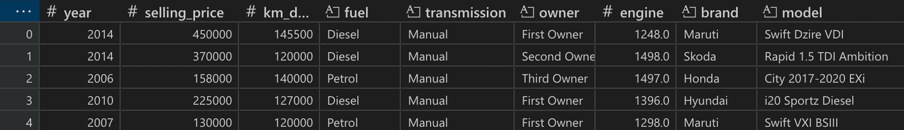 | First 5 rows of the dataset |
| 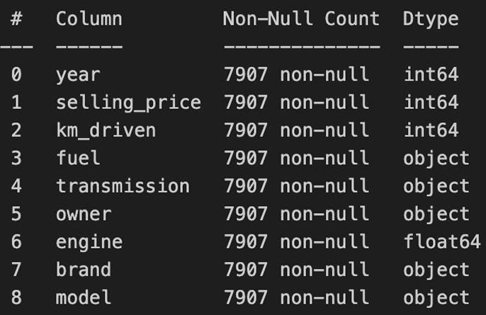 | Column specifications |
| 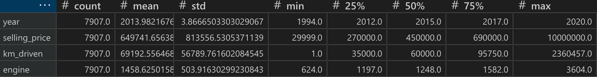 | Summary statistics of numeric attributes |
| 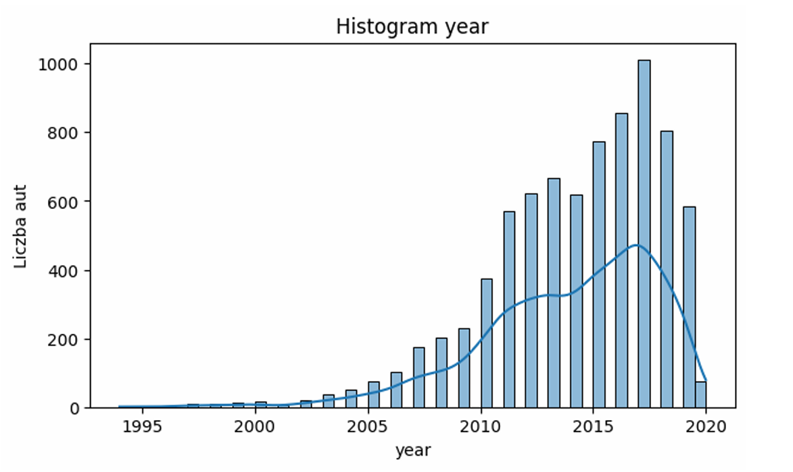 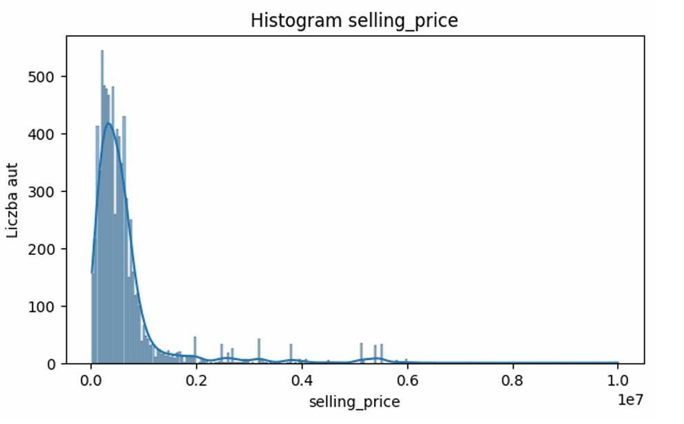 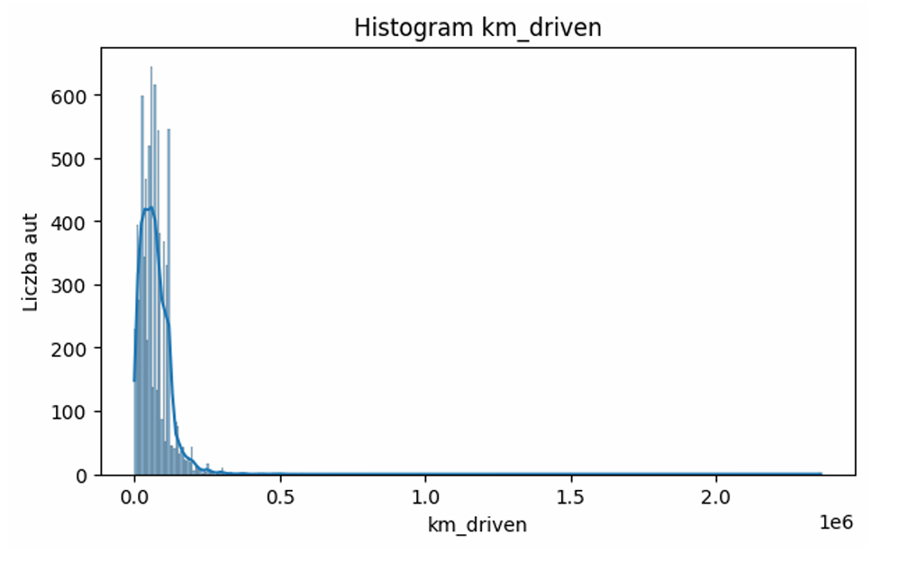 | Distributions of numeric features |
| 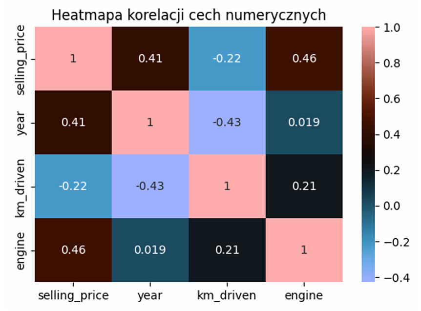 | Correlation heat-map – strong positive links between price and the other numeric columns |
| 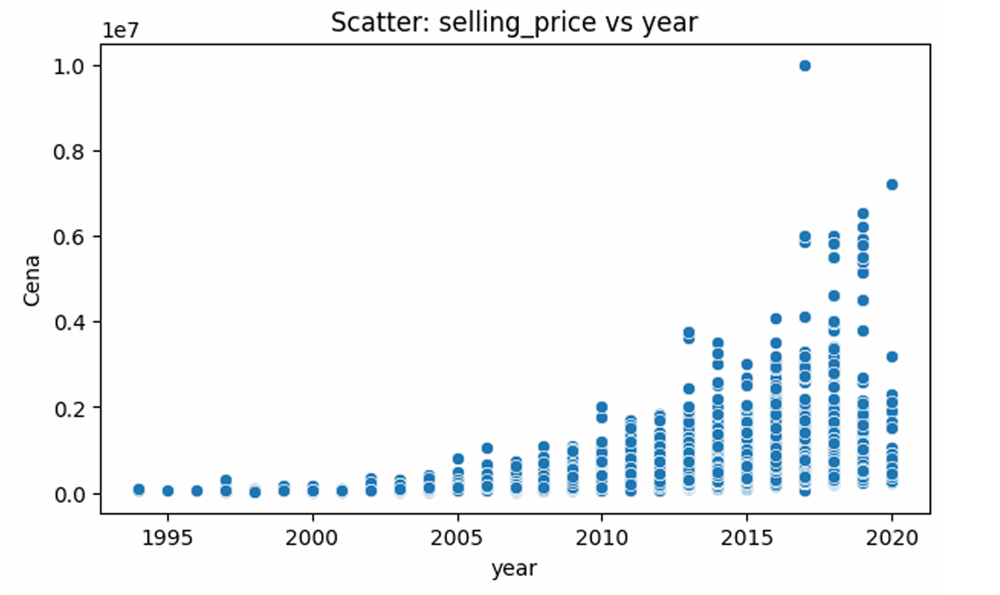 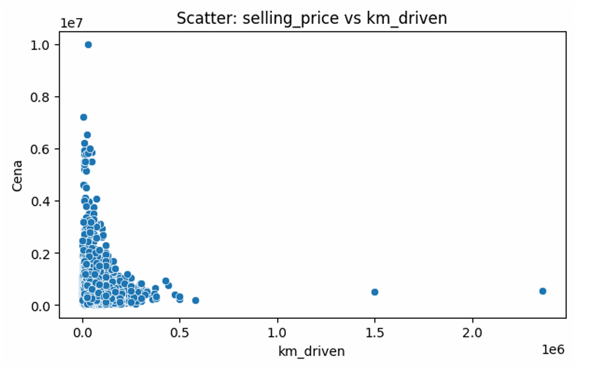 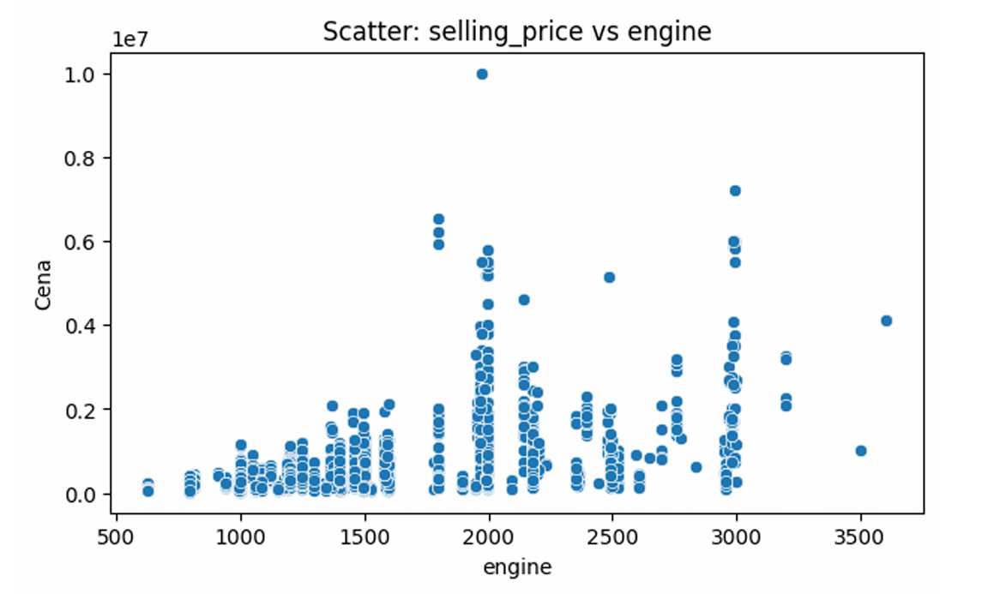 | Scatter-plots: `selling_price` vs. every numeric feature |
| 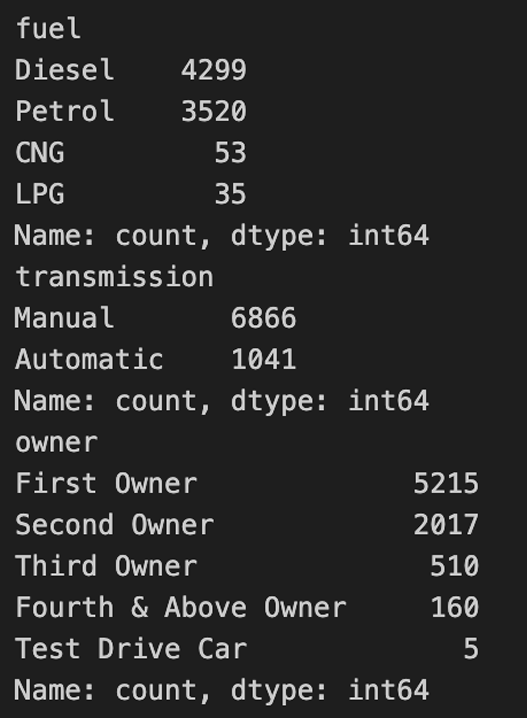 | Counts of categorical features |
| 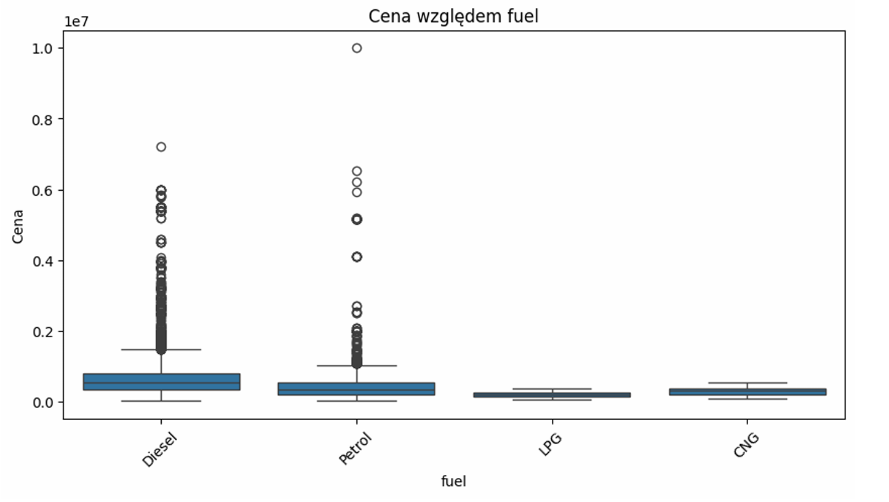 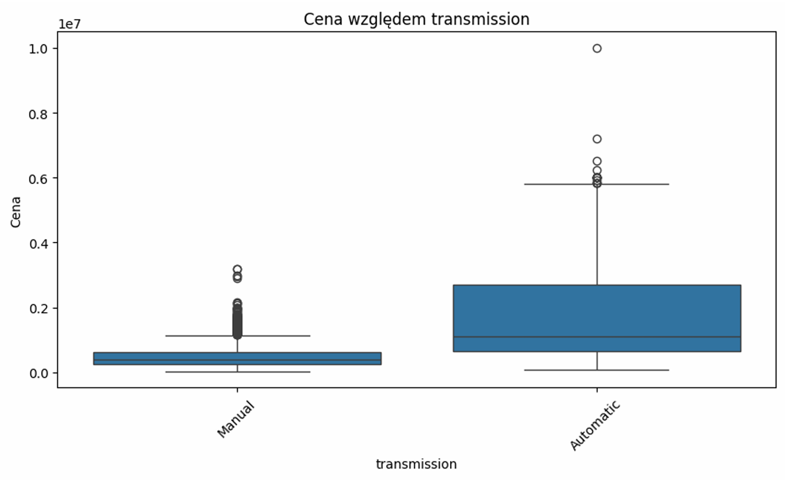 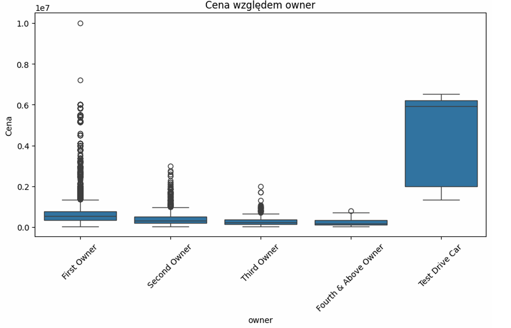 | Box-plots: price segmented by each categorical feature |

## 4&nbsp;· Baseline Results (before tuning)  
The three models were trained with default hyper-parameters on an 80 / 20 train-test split. Performance metrics (MAE, RMSE, R²) were recorded for later comparison.

## 5&nbsp;· Hyper-parameter Optimisation  
Random search (50 iterations, 5-fold CV) was applied to every algorithm. Key ranges included:  

| Model | Parameters explored |
|-------|---------------------|
| Random Forest | `n_estimators`, `max_depth`, `min_samples_leaf` |
| SVR | `C`, `ε`, `γ` |
| MLP | hidden-layer sizes, activation, regularisation, learning-rate |

The optimal settings found are documented in the notebook and yielded the **post-tuning** metrics shown below.

| Model | MAE&nbsp;(baseline) | MAE&nbsp;(tuned) | RMSE&nbsp;(baseline) | RMSE&nbsp;(tuned) |
|-------|--------------------|------------------|----------------------|-------------------|
| Random Forest | *low* | slightly lower | *low* | marginal change |
| SVR | moderate | **noticeably lower** | moderate | **lower** |
| MLP | highest | **largest drop** | high | **largest drop** |

## 6&nbsp;· Findings  
* Hyper-parameter search consistently reduced error, most dramatically for the MLP.  
* Random Forest achieved robust results even without heavy tuning, illustrating the algorithm’s resilience.  
* SVR required careful calibration of `C` and kernel width but then matched Random Forest.  
* The strong correlations in numeric features confirm that simple tabular preprocessing is enough to unlock predictive signal.

## 7&nbsp;· Possible Extensions  
* Introduce gradient-boosted trees (e.g., XGBoost, LightGBM) for potentially better bias–variance trade-offs.  
* Engineer new features such as torque, horsepower or brand embeddings to capture domain nuances.  
* Wrap the best model in a lightweight FastAPI or Streamlit app for real-time price inference.

